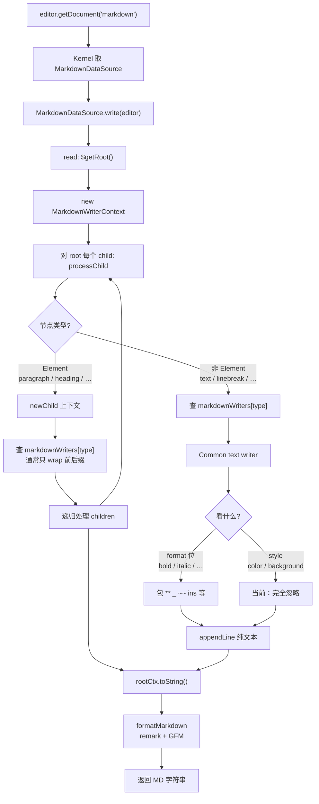
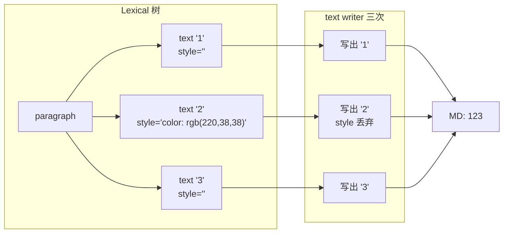

# Markdown 导出流程

> 一句话：`getDocument('markdown')` 如何从 Lexical 树变成 MD 字符串，以及颜色（style）在哪一步丢掉。

## 全量导出主流程

## 以「123，2 变红」为例

## 关键缺口

颜色只活在 `TextNode.style`；导出 text writer 只读 `format`，所以红「2」和普通「2」写出一样。
